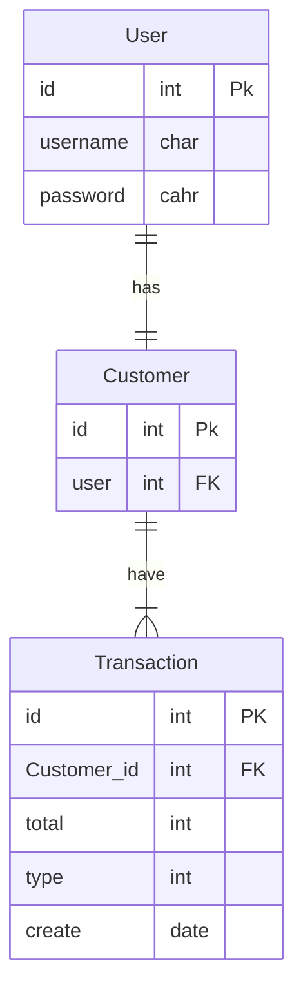

<<<<<<< HEAD

### User

| Field | Type | Domain | Key |
| ---   | ---  | ----|---  |
|id  | INT  |  ()  | PK |
|username | Char  |  255 |  |
|password|Char | 255 ||
||

### Customer
| Field | Type | Domain | Key |
| ---   | ---  |   ---    |---  |
|  id  |  INT | 10 | PK |
| user | char | () | FK |

### Transaction
| Field | Type | Domain | Key |
| ---   | ---  | ---    |---  |
| id | int | 10 | PK |
| Customer_id | INT | 10 | FK |
| total | DECIMAL | (9,2) |  |
| type | INT |  |  |
| create | Date  |  |
=======

>>>>>>> 73442a702ecead9bfdd22a16954eae0100db8034
